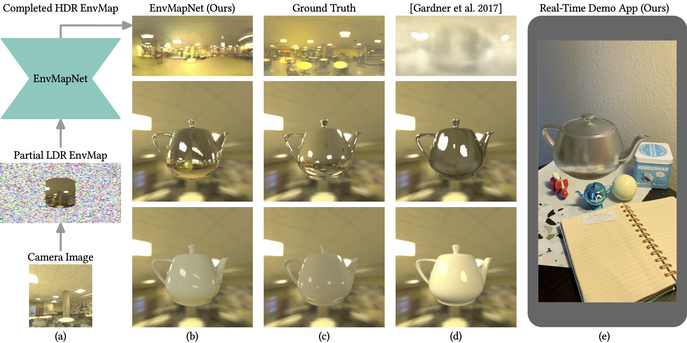

# HDR Environment Map Estimation for Real-Time Augmented Reality

This software project contains implementations of metrics used in the paper, **HDR Environment Map Estimation for Real-Time Augmented Reality**, Gowri Somanath, Daniel Kurz, *Proc. IEEE/CVF CVPR 2021*, which can be found on [Machine Learning Research at Apple](https://machinelearning.apple.com/research/hdr-environment-map-estimation) and [arXiv](https://arxiv.org/abs/2011.10687). 


Given a partial LDR environment map from a camera image (a), we estimate a visually coherent and completed HDR map that can
be used by graphics engines to create light probes. These enable rendering virtual objects with any material finish into the real environment
in a perceptually pleasing and realistic way (b), more similar to ground truth (c) than state-of-the-art methods (d). Our mobile app renders
a virtual teapot using our estimated environment map in real-time (e).

## Results
We performed quantitative benchmarking using the metrics provided, and results on the publicly available [Laval Indoor HDR Images dataset](http://indoor.hdrdb.com/).
We encourage related future research to use the same metrics and the provided implementations thereof to ensure comparability of experimental results.
See paper for details.

| Method | FID | AngularError |
| --- | --- | --- |
| EnvMapNet (Ours) |  52.7 |  34.3 ± 18.5| 
| Ours without ProjectionLoss|  77.7 | 39.2 ± 29.9| 
| Ours without ClusterLoss|  203 | 75.1 ± 25| 
| Gardner et al. | 197.4 | 65.3 ± 24.5| 
| Artist IBL (Fixed) | - | 46.5 ± 15.4| 


## Metrics Computation and Demo
To get started, feel free to run the provided demo application as follows:
```
python DemoEnvMapNetMetrics.py
```
The demo uses metrics implemented in ```FIDCalculations.py``` and ```ParametricLights.py```.
The metrics are detailed in Section 4 (Metrics for benchmarking), and the results are presented in Table 1 and Section 5 of the paper.

This code has been tested with Python 3.6 and 3.7, and it has dependencies on the following packages.

For parametric lights and angular error:

1. `pip3 install opencv-python`
2. `pip3 install scikit-image`

Additional requirements for Frechet Inception Distance (FID):

3. `pip3 install --upgrade keras==2.2.4`
4. `pip3 install py360convert`


